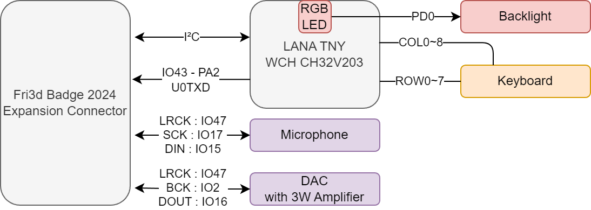

# Communicator add-on

## Communicator features

The communicator is built around :

- backlit QWERTY Keyboard designed by [Solder Party](https://www.solder.party/)
- RISC-V based microcontroller board [LANA TNY](https://phyx.be/LANA_TNY/)
- [TDK ICS43434](https://invensense.tdk.com/products/ics-43434/) microphone
- [Analog Devices MAX98357A](https://www.analog.com/en/products/max98357a.html) DAC with amplifier
- small speaker.

You can also use the keyboard as an USB keyboard, however **do not plug in the USB cable when it's connected to the badge**!

You can get the design files and sources in the [GitHub repository](https://github.com/Fri3dCamp/communicator_2024)

## Step by step assembly guide

### All components neatly packaged

The package you received contains everything you need to build your own communicator add-on

- Communicator main PCB
- Pink cover PCB
- 4 x 16mm long spacers
- 4 x 2mm long spacers
- speaker
- silicone keyboard
- 2 x 6 pin extra long headers

### Mount the speaker

Remove the protective layer and glue the speaker on the PCB. Solder the 2 wire on the pads, the red wire should go the the pad marked with a `+` symbol.

### Solder the long pin headers

Place the headers on the side of the component side of the board. You can use a female pin header (of even the badge) to keep the 2 pin headers properly aligned while soldering

### Mount the keys

Snap in the 2mm spacers in the pink cover. place the silicone keyboard in the PCB and snap in into the communicator PCB.

### Mount the communicator

Snap in the 16mm long spacers in the 4 holes, mount it on the back of the badge in place of the protective backplate.

## Usage

The keyboard presents itself as a HID input device.
The `Fn` key can be used to trigger special functions:

- `Fn+Red Square`: Put LANA LED to red
- `Fn+Orange Triangle`: Put LANA LED to orange
- `Fn+Yellow Fri3d logo`: Put LANA LED to yellow
- `Fn+Green Circle`: Put LANA LED to green
- `Fn+Blue Three-Leaf-Clover`: Put LANA LED to blue
- `Fn+Purple Rhombus`: Put LANA LED to purple
- `Fn+Solder Party`: Put LANA LED off
- `Fn+Backspace`: Delete
- `Fn+Up`: Page Up
- `Fn+Down`: Page Down
- `Fn+Left`: Home
- `Fn+Right`: End
- `Fn+Spacebar`: Toggle keyboard backlight
- `Fn+Right Shift`: Toggle Caps Lock

## Firmware features

The firmware outputs [HID report packets](https://files.microscan.com/helpfiles/ms4_help_file/ms-4_help-02-46.html) (8 bytes) on USB, I2C (address `0x38`) and UART.

The first byte indicates the modifier keys that have been pressed:

| Bit | Modifier Key |
| --- | ------------ |
| 0   | LEFT CTRL    |
| 1   | LEFT SHIFT   |
| 2   | LEFT ALT     |
| 3   | LEFT GUI     |
| 4   | RIGHT CTRL   |
| 5   | RIGHT SHIFT  |
| 6   | RIGHT ALT    |
| 7   | RIGHT GUI    |

The second byte is reserved, the remaining 6 bytes can contain a [HID keycode](https://gist.github.com/MightyPork/6da26e382a7ad91b5496ee55fdc73db2).
