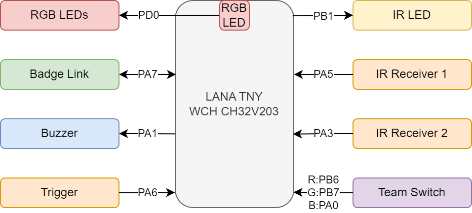
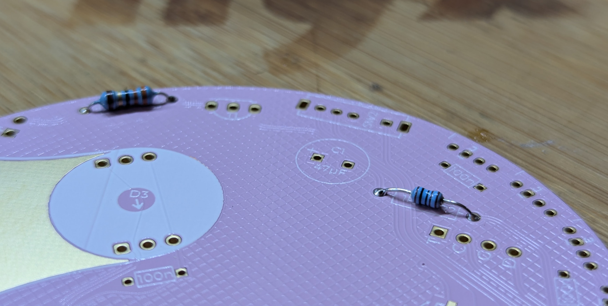
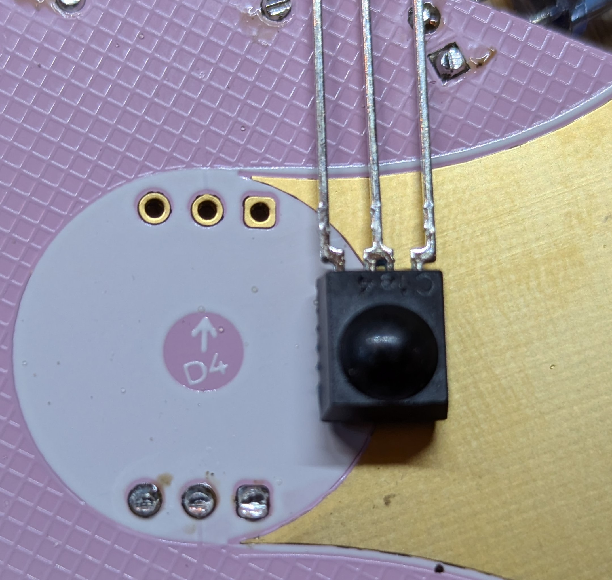
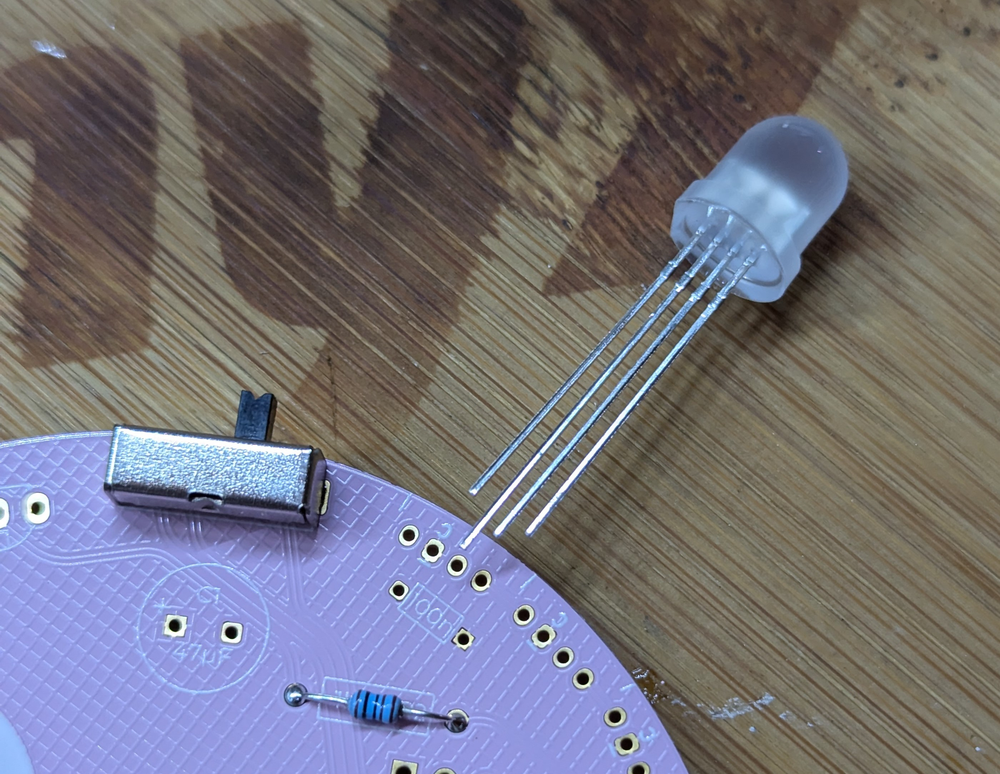
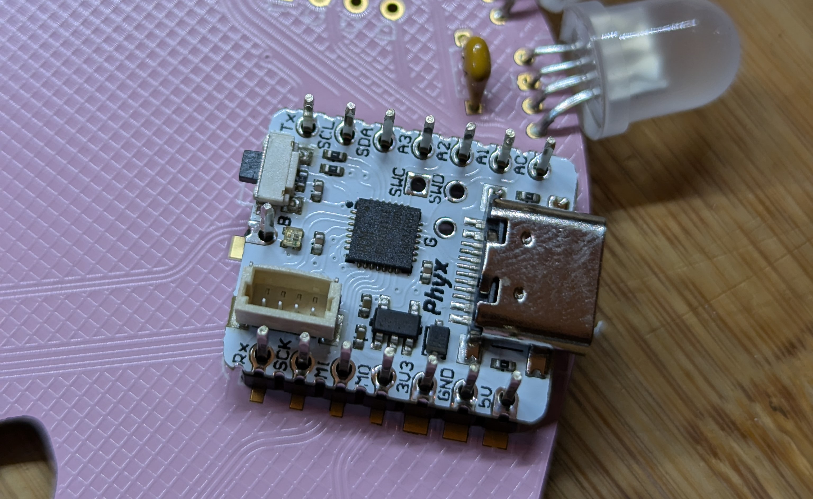
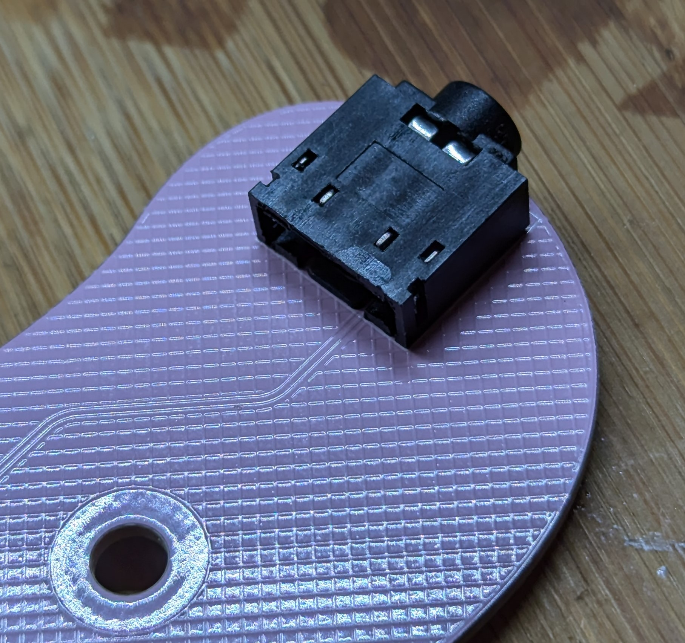

# Big Flamingo Gun 9000

## Features
The flamingo blaster is built around basic components: 

- an IR LED 
- 2 IR receivers
- 4 WS2812 LEDs 
- RISC-V based microcontroller board [LANA TNY](https://phyx.be/LANA_TNY/)

**Do not plug in the USB cable when it's connected to the badge**!

## Step by step assembly guide

### All components neatly packaged
The package you received has everything you need to build your own flamingo blaster.

- 1 IR LED
- 1 team selector switch
- 1 large blue capacitor
- 1 buzzer
- 1 trigger pushbutton
- 1 long strip of pin headers (to be split in half)
- 1 single pin header
- 1 MOSFET
- 1 [LANA TNY](https://phyx.be/LANA_TNY/)
- 1 pink PCB
- 1 badge link cable
- 2 IR receivers
- 2 resistors
- 2 badge link connectors
- 3 yellow capacitors (100nF)
- 4 WS2812 LEDs

### Start soldering
There is no bad order in which to solder the parts, we dop however suggest starting with the lowest profile parts first. 

### Resistors
The package contains a larger 33R resistor and a smaller 1k resistor. 

### Team switch and speaker
The next components with a low profile are the buzzer and the team switch. Mount the switch with the actuator facing away from the PCB.

### IR LED
The infrared LED does have a polarity. Mounting it the wrong way around results in a non-functional blaster. The long lead of the LED should go in the square hole with the `+` symbol next to it. Make sure you leave some room in order to bend te LED forward (or even better, bend it before soldering it!)

### IR receivers
The 2 IR receivers mount directions are indicated by an arrow. This arrow points towards the direction the pins should go.

### RGB LEDs
The RGB LEDs have 4 leads, the longest lead should go in the hole marked with the letter `c` . Once inserted, bend the LED before soldering. This allows you to slightly adjust the alignment before fixing them in place.

### Trigger button
If you're right handed, solder the trigger switch on the side with all the other components. 

### LANA TNY module
Use the large and single pin header to solder the [LANA TNY](https://phyx.be/LANA_TNY/) module. Break the long pin header in 2 for the sides. Place the pins in the flamingo and align the LANA module on top of it. Alternate soldering the pins to prevent the pin header melting.

### Badge link connector
Last part is the badge link connector. This 3.5mm audio jack is soldered on the same side as all the other components

### Finished blaster
If everything goes according to plan you should now have a functional blaster.

### Mount the connector on your badge
Now all that is left to do is adding the badge link connector to your badge. Mount this connector on the back side of badge (the same side as the wireless module and battery).

## Notes

Firmware updates can be flashed through the badge flash station in the solder area.

Hardware design files and Firmware sources can be found in [the GitHub repository.](https://github.com/Fri3dCamp/blaster_2024)