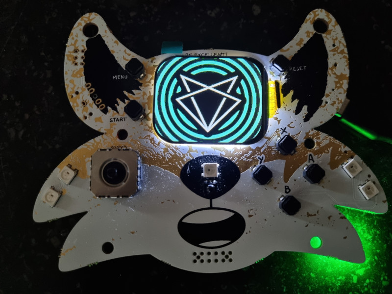

# Fri3d Camp 2024 Badge

So you got a cool badge, what can you do with it? ;-)

## Play with it

You don't need to be a programming wizard to have fun with this badge!
Go to the [Onboarding](Onboarding) pages to see all the cool features we built into the standard firmware.

## Program it

Congratulations! If you want to squash some bugs, you're going to need some tools...

- You can use **C++** in the [Arduino editor](arduino), or [Visual Studio Code](platformio)
- If you prefer [Python](micropython), you can use any plain text editor, but Visual Studio Code works too.
- If you are into homeassistant and want to connect your badge using [esphome](esphome). You can either use the command line or esphome dashboard.
- If typing code is not your thing, you can drag blocks in [bipes](bipes)

## Revert to Default Firmware

After your adventures in programming yielded unexpected results, you might want to go back to the default firmware.
Look around for a "badge reset firmware" booth on the Fri3d camp. We sort of anticipated this ... :-)

If you want to perform the reset yourself:

1. if your badge seems to reset every few seconds. You can force every ESP32-based board as follows:
    11. press and hold "start" button (this is the "boot" button of the microcontroller)
    12. press and release "reset" button
    13. your badge will now be ready to be flashed with a new program
2. install ESP-IDF <https://docs.espressif.com/projects/esp-idf/en/stable/esp32/get-started/index.html#installation>
3. download the latest firmware from <https://github.com/Fri3dCamp/badge_2024_micropython>
4. on your command line interface type:

        python -m esptool -p (PORT) -b 460800 --before default_reset --after no_reset --chip esp32s3 write_flash --flash_mode dio --flash_size 16MB --flash_freq 80m 0x0 bootloader.bin 0x8000 partition-table.bin 0x1d000 ota_data_initial.bin 0x30000 micropython.bin

## Documentation

- The introduction: <https://github.com/Fri3dCamp/badge_2024>
- The hardware: <https://github.com/Fri3dCamp/badge_2024_hw>
- C++ examples: <https://github.com/Fri3dCamp/badge_2024_arduino>
- pre-loaded Firmware: <https://github.com/Fri3dCamp/badge_2024_micropython>
