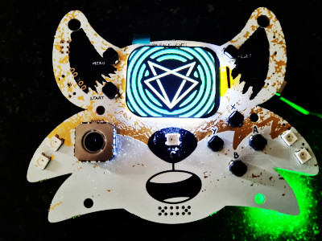

# Fri3d Camp 2024 Badge

Proficiat met je coole nieuwe badge! Maar wat kan je er zoal mee doen? ;-)

## Spelen!

Je moet geen programmeer-goochelaar te zijn om leuke dingen te doen!
Op de [Onboarding](Onboarding) pagina zie je de dingen die standaard al ingebouwd zijn.

## Programmeren

Om te programmeren (en bugs te vermijden) heb je de juiste tools nodig...

- Je kan **C++** in de [Arduino editor](arduino), of [Visual Studio Code](platformio)
- Wie liever [Python](micropython) programmeert, kan gelijk welke tekst editor gebruiken, maar Visual Studio Code geeft je wel wat extras.
- Om je badge te laten babbelen met je smart home is er [esphome](esphome). Je kan de command line gebruiken of het esphome dashboard.
- Als je liever niet typt, kan je blokjes slepen met [bipes](bipes), een beetje zoals Scratch

## Reset Default Firmware

ALs je helemaal in de knoop zit en je geraakt er niet uit, wil je misschien terug naar de default firmware.
Op het kamp zullen we een standje voorzien waar je je badge kan resetten. Je ziet; we hebben aan alles gedacht! :-)

Hier is hoe je thuis zelf kan resetten:

1. Als je badge om de paar seconden spontaan reset, kan je ze als volgt "forceren" om te luisteren naar een nieuwe upload:
    11. Klik en houd de "start" knop (Op ESP32 heet dit de "boot button")
    12. Klik en laat los de "reset" knop
    13. Je badge staat nu in "download" mode tot je opnieuw reset duwt
2. installeer ESP-IDF <https://docs.espressif.com/projects/esp-idf/en/stable/esp32/get-started/index.html#installation>
3. Download de meest recente firmware op <https://github.com/Fri3dCamp/badge_2024_micropython>
4. in de command line interface, type:

        python -m esptool -p (PORT) -b 460800 --before default_reset --after no_reset --chip esp32s3 write_flash --flash_mode dio --flash_size 16MB --flash_freq 80m 0x0 bootloader.bin 0x8000 partition-table.bin 0x1d000 ota_data_initial.bin 0x30000 micropython.bin

## Documentation

- The introduction: <https://github.com/Fri3dCamp/badge_2024>
- The hardware: <https://github.com/Fri3dCamp/badge_2024_hw>
- C++ examples: <https://github.com/Fri3dCamp/badge_2024_arduino>
- pre-loaded Firmware: <https://github.com/Fri3dCamp/badge_2024_micropython>
