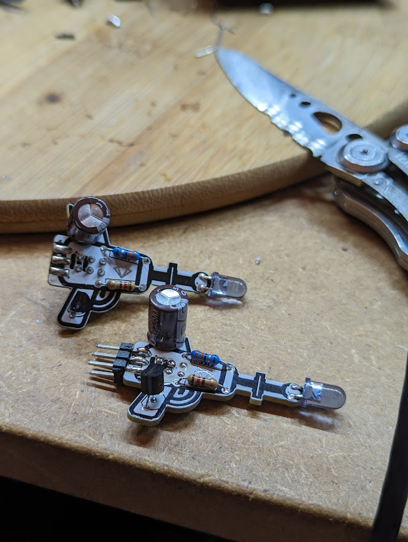

# Noisy Cricket

## Assembly photos
1. All components neatly packaged

2. Spread out in order of soldering

3. Component side of the pcb is where the fri3d logo is  
- 33 Ohm (blue body and orange,orange.black colored bands) resistor on top  
- 120 Ohm (beige body and black,red,black colored bands) risistor on bottom  
2 resistors soldered

4. NPN transistor 2N3904 with flat side to the left (back of noisy cricket)

5. Electrolytic capacitor (33 microFarad)  
Mind the **polarity**: long leg is positive, short leg is negative, white marking on the body is negative  
There are 2 holes for positive and 2 holes for negative, choose best fitting ones

6. Pin header soldered on the bottom  
2 orientations are possible:
- on the bottom: this results in an upright position when mounted on the fri3d2024 badge
- at the back: this results in a front facing position when mounted on the fri3d2024 badge

7. Ready to solder the LED  
Mind the **polarity**: long leg is positive, short leg is negative, flat side on the body is negative

8. LED soldered  
Mind the **polarity**: positive (long leg) on the bottom, negative on top (short leg, flat side on the body)

9. Overview pictures of soldered Noisy Cricket

10. Noisy Cricket mounted on the fri3d2024 badge
Mounted with the pin header soldered on the bottom

Mounted with the pin header soldered on the back

