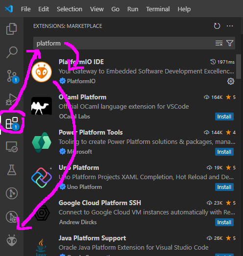

# PlatformIO

## Visual Studio Code

Hier kan je VS Code downloaden: <https://code.visualstudio.com/>.
Maak je geen zorgen als tijdens de installatie gevraagd wordt welke extensie je wil installeren. De nodige extensies kan je makkelijk achteraf installeren.

## PlatformIO extensie

1. In Visual Studio Code, ga naar de "extensions" tab. (CTRL+SHIFT+X)
2. In de search bar, type "platformio"
3. Installeer die met de oranje alien icon

  

## Hello World

1. open het PlatformIO window (klik het alien icoon in de linker kolom)
2. Kies "New Project"
      1. Als je het "PlatformIO home" window ziet, kan je ook op de "+ new project" knop klikken.
3. Bij een nieuw project moet je"esp32-s3-devkitc-1" als board kiezen. PlatformIO zal nu een hoop libraries downloaden. Dat kan eventjes duren.
4. Open platformio.ini - daar zou je het volgende moeten vinden:
```
    [env:esp32-s3-devkitc-1]
    platform = espressif32
    board = esp32-s3-devkitc-1
    framework = arduino
```
5. voeg volgende lijntjes onderaan toe:
```
    board_build.arduino.memory_type = qio_opi 
    board_build.partitions = default_16MB.csv
    board_upload.flash_size = 16MB
    monitor_speed = 115200
    lib_deps = bodmer/TFT_eSPI@^2.5.33
    build_flags = 
        -DBOARD_HAS_PSRAM # N16R8V has PSRAM
        -DARDUINO_USB_MODE=1 # necessary for serial port
        -DARDUINO_USB_CDC_ON_BOOT=1 # necessary for serial port
```


## Voorbeeld code in GitHub

<https://github.com/Fri3dCamp/badge_2024_arduino/tree/main/examples/platformio%20basic%20examples>

Om de hele mikmak te downloaden:

1. Surf naar <https://github.com/Fri3dCamp/badge_2024_arduino>
2. Klik "Fork"
3. De hele repository staat nu identiek in je eigen account op github
4. Klik op de groene knop `<> Code`
5. CTRL-C de URL die je vindt in de pop-up
6. Open je Git Bash CLI in de folder waar je je code lokaal wil plaatsen
7. Type `git clone ` en CTRL-V URL from the Github repository

## Your own code on GitHub

1. Download GIT vanop <https://git-scm.com/downloads>
2. Creeer je account op <https://github.com>
3. Bovenaan het scherm, klik "+", dan "New repository"
4. Volg de instructies op de GitHub pagina om de repository te clonen naar je eigen harde schijf.
5. Coderen maar!
6. Als je klaar bent, open de Git Bash CLI in de root folder van je repository
7. `git add .`
8. `git commit -m "cool new program"`
9. `git push`
10. Check op de Github website dat je nieuwe code is gearriveerd

## Your code in the Fri3d Camp repository

1. Surf naar <https://github.com/Fri3dCamp/badge_2024_arduino>
2. Klik "Fork"
3. De hele repository staat nu identiek in je eigen account op github
4. Klik op de groene knop `<> Code`
5. CTRL-C de URL die je vindt in de pop-up
6. Open je Git Bash CLI in de folder waar je je code lokaal wil plaatsen
7. Type `git clone ` en CTRL-V URL from the Github repository

Tot nu waren de instructies identiek aan het downloaden van de voorbeelden

8. In githubm klik `main` om een nieuwe branch aan te maken
9. In de zoekbar, typ een nieuwe naam naar keuze, bv. `mijneigenvoorbeeld`
10. Klik `create branch mijneigenvoorbeeld` from main
11. Open the Git Bash CLI in the root folder of your repository
12. `git checkout -b newexample`
13. Maak nu de code/het project voor je eigen voorbeeld. Daarna:
14. `git add .`
15. `git commit -m "nieuw voorbeeld toegevoegd"`
16. `git push`
17. in GitHub, klik `compare and pull request`
18. Voeg een goede  beschrijving toe van wat je voorbeeld doet,
19. Klik `Create pull request`