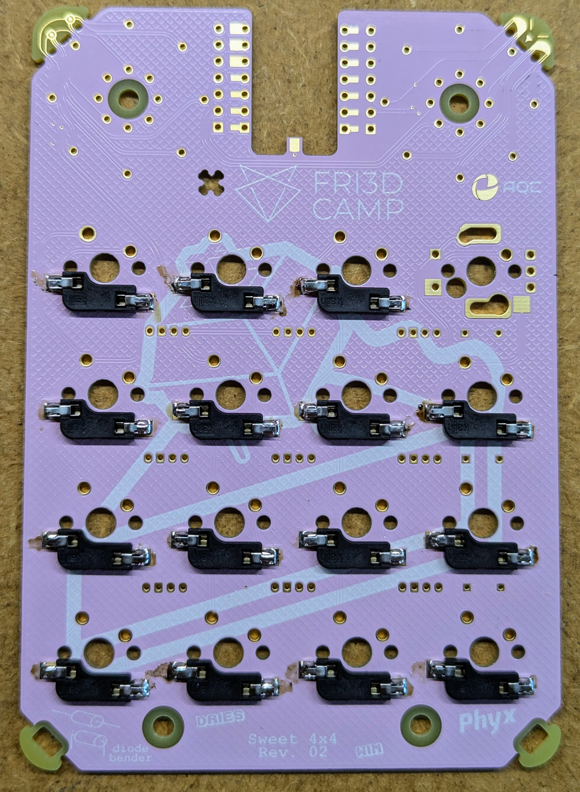
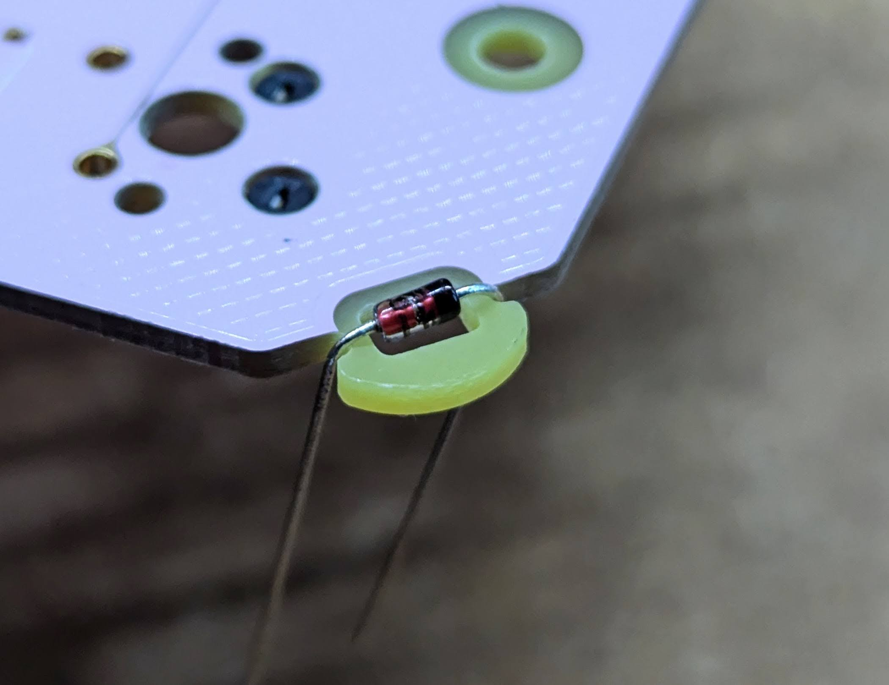
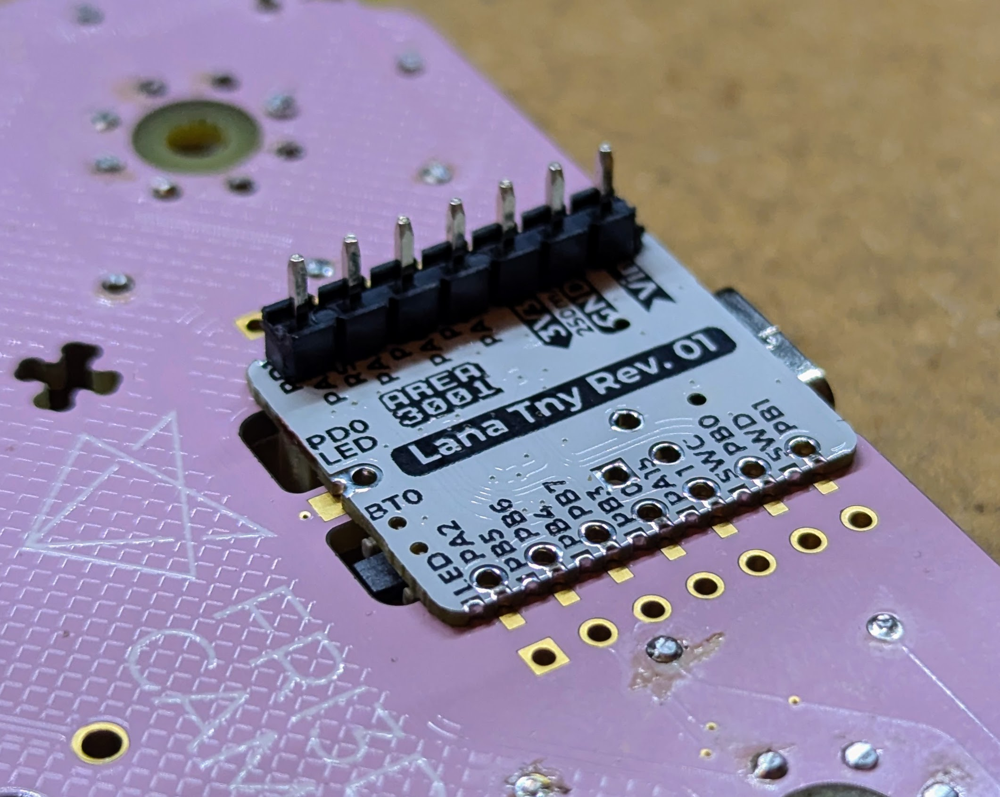
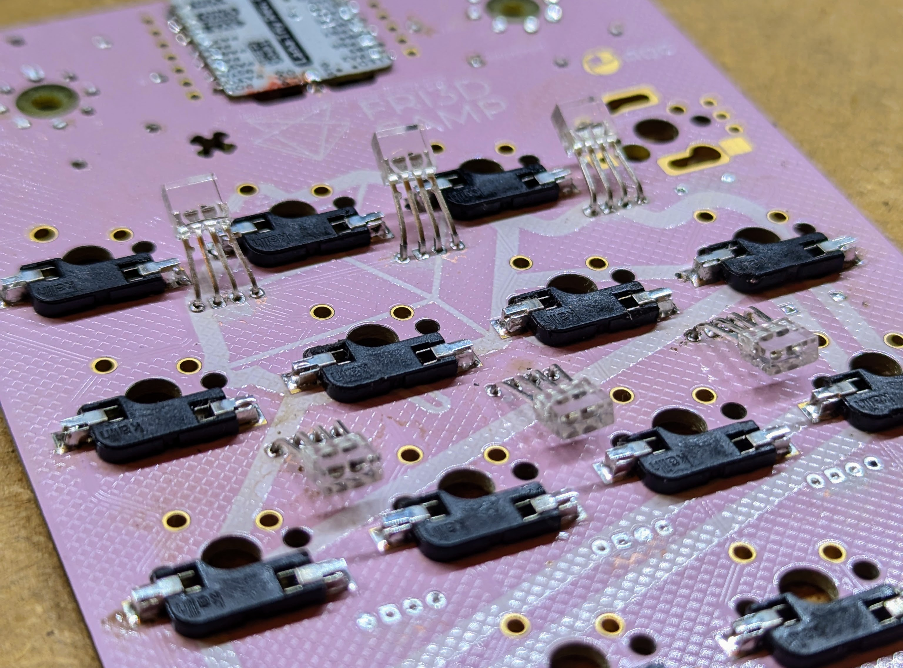
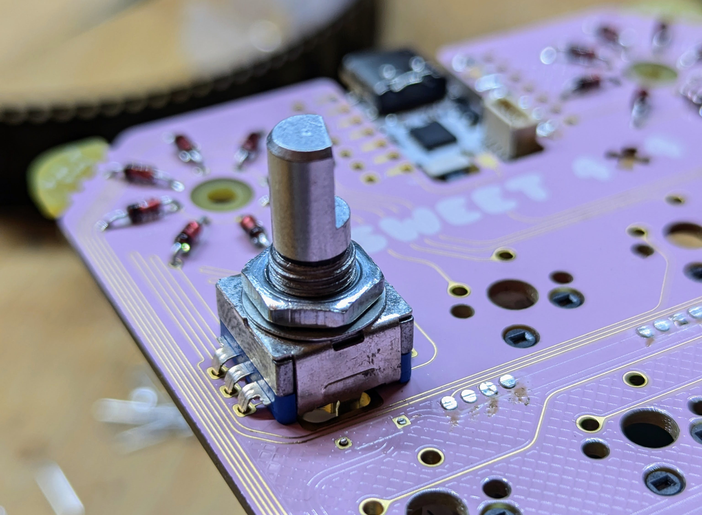

# Sweet 4x4

## Features
The sweet 4x4 macropad is at its 3rd iteration. This tiume you'll use a [LANA TNY](https://phyx.be/LANA_TNY/) (or any other [XIAO / QtPy compatible board](https://github.com/adafruit/awesome-qt-py)) at the heart of this macropad. 
You can opt for 16 keys or 15 keys and a rotary encoder.

## Step by step assembly guide

### Overview
The package you received has everything you need to build your own Sweet 4x4.

- 15 sockets
- 15 switches
- 16 diodes
- 6 WAS2812 LEDs
- 2 capacitors
- 1 [LANA TNY](https://phyx.be/LANA_TNY/)
- 1 pink PCB
- Screws and standoffs `HOW MANY?`

### Sockets
Let's start off with the lowest components. In this case the key sockets. Place the sockets in the holes and solder the 2 SMD pads on the sides. Do this 15 times unless you do not want an encoders, then you can opt for 16 sockets and keys. (For those not wanting sockets, you can also solder your keys directly on the PCB)

### Diodes
The 16 diodes should be bent to properly fit in the PCB. Therefor the 2 bottom corners are designed as dedicated to bending these parts. Once all the diodes are bent, you can start soldering them in the 2 circles next. The black line on the diode (the cathode) should be facing outward.

### LANA TNY
You can solder the[LANA TNY](https://phyx.be/LANA_TNY/) module using the supplied through hole pins OR you can SMD mount it for the lowest profile solution. When opting for the surface mount solution, you can use some of the pins to properly align the module before soldering as shown below.

### WS2812 LEDs
Solder 6 WS2812 RGB LEDs on the bottom as indicated in the pictures below. Don't press the LEDs down too far to prevent damage to the LED. Also prevent shorting the LED pins with the SMD sockets pins by not bending it all the way to the board as shown in the pictures below.

### Capacitors
In order to reduce the total height of the keyboard, you should bend the capacitor before soldering it.

### Encoder
If you like a rotary encoder, place one in the upper left corner of the key matrix and sodler the 7 pins (5 smaller and 2 bigger ones). The larger pins, used for mechanical strength, might require a lot of solder to fille the holes.

### Switches
`INSERT IMAGE WITH THE PLEXI PLATE`

### Casing
Screws? Spacers? Plexi?

### Keycaps
Snap on the keycaps of your choice.

## N-key rollover
A keyboard with n-key rollover, or abbreviated as NKRO, has the ability to scan each button press individually, as opposed to having the PC do it. As a result, every pressed button, or key, is noted, even if you’re pressing a bunch of keys simultaneously.

Sometimes you'll see the "n" in n-key rollover replaced with a number. That number tells you how many keys you can press simultaneously with the keyboard being aware. For example, if your keyboard has 6-key rollover, you can press six keys at once with successful input. N-key rollover is particularly relevant/helpful for gaming keyboards.

Not all keyboards come with n-key rollover, as implementing the feature comes with certain cost and design challenges.

To enable n-key rollover on this macropad, break off the 2 top corners to break the short circuit and use the diodes.

## Firmware
`INSERT INFO`